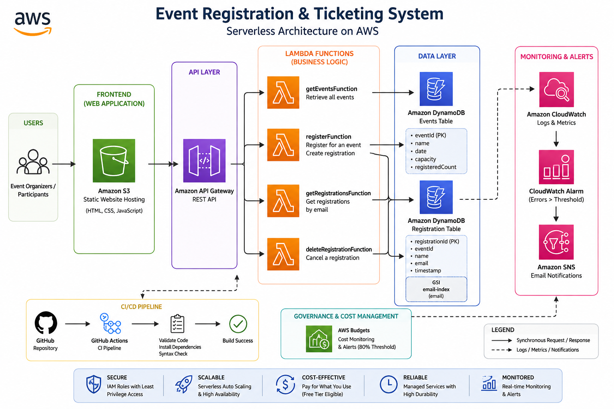

# Event Registration & Ticketing System
## A Serverless API



---

## Project Information

**Student:** Kwame Opoku Ware

**Program:** AWS Cloud Computing Capstone Project (Generation Ghana & Azubi Africa)

**Project:** Event Registration & Ticketing System - A Serverless API

**GitHub Repository:**
https://github.com/OwassJnr/event-registration-ticketing-system

**Live Frontend:**
http://event-registration-opokuware.s3-website-eu-west-1.amazonaws.com

**API URL:**
https://knpn96h9b4.execute-api.eu-west-1.amazonaws.com/prod

---

# Project Overview

The Event Registration & Ticketing System is a fully serverless cloud-native application built on Amazon Web Services (AWS).

The project replaces manual event registration processes that rely on Microsoft Forms and Excel spreadsheets with a scalable, highly available REST API architecture.

The system enables users to:

- See available events
- Register for events
- Retrieve their registrations
- Cancel registrations

The solution leverages AWS managed services to reduce operational overhead while providing scalability, security, monitoring, and cost efficiency.

---

# Problem Statement

Traditional event registration processes often rely on:

- Microsoft Forms
- Excel spreadsheets
- Manual data entry
- Manual participant tracking

These approaches introduce challenges such as:

- Poor scalability
- Human errors
- Limited automation
- Difficult reporting
- Lack of monitoring
- No centralized API

This project addresses these challenges by implementing a fully serverless event registration platform.

---

# Solution Architecture

The application follows a serverless architecture pattern.

## Architecture Components

### Frontend

- HTML5
- CSS3
- JavaScript

Hosted using:

- Amazon S3 Static Website Hosting

### Backend

- Amazon API Gateway
- AWS Lambda

### Database

- Amazon DynamoDB

### Monitoring

- Amazon CloudWatch
- Amazon SNS

### Cost Management

- AWS Budgets

### DevOps

- GitHub
- GitHub Actions

---

# Architecture Diagram


### Architecture Flow

1. User accesses frontend hosted on Amazon S3.
2. Frontend sends requests to Amazon API Gateway.
3. API Gateway invokes Lambda functions.
4. Lambda functions interact with DynamoDB tables.
5. CloudWatch collects logs and metrics.
6. CloudWatch alarms trigger SNS notifications.
7. AWS Budgets monitor project spending.

---

# AWS Services Used

| Service | Purpose |
|----------|----------|
| Amazon S3 | Frontend Hosting |
| Amazon API Gateway | REST API Endpoints |
| AWS Lambda | Serverless Business Logic |
| Amazon DynamoDB | Data Storage |
| Amazon CloudWatch | Logging & Monitoring |
| Amazon SNS | Alert Notifications |
| AWS Budgets | Cost Monitoring |
| GitHub Actions | Continuous Integration |

---

# API Endpoints

## Get Events

```http
GET /events
```

Returns all available events.

### Example Response

```json
[
  {
    "eventId": "EVT001",
    "name": "AWS Workshop Accra 2026",
    "date": "2026-05-15",
    "capacity": 100
  }
]
```

---

## Register For Event

```http
POST /register
```

### Request Body

```json
{
  "eventId": "EVT001",
  "name": "John Doe",
  "email": "john@example.com"
}
```

### Response

```json
{
  "message": "Registration successful",
  "registrationId": "xxxxxxxx"
}
```

---

## Get Registrations

```http
GET /registrations/{email}
```

### Example

```http
GET /registrations/john@example.com
```

Returns all registrations associated with the supplied email address.

---

## Cancel Registration

```http
DELETE /registration/{id}
```

### Example

```http
DELETE /registration/123456
```

Removes the selected registration.

---

# DynamoDB Database Design

## Events Table

### Partition Key

```text
eventId
```

### Attributes

```text
eventId
name
date
capacity
registeredCount
```

---

## Registration Table

### Partition Key

```text
registrationId
```

### Attributes

```text
registrationId
eventId
name
email
timestamp
```

### Global Secondary Index

```text
email-index
```

Used to retrieve registrations by email address.

---

# Lambda Functions

The backend consists of four AWS Lambda functions.

## getEventsFunction

Responsible for retrieving all events.

### DynamoDB Table

```text
Events
```

---

## registerFunction

Responsible for creating registrations.

### DynamoDB Tables

```text
Events
Registration
```

---

## getRegistrationsFunction

Retrieves registrations using email-index.

### DynamoDB Table

```text
Registration
```

---

## deleteRegistrationFunction

Deletes existing registrations.

### DynamoDB Table

```text
Registration
```

---

# CI/CD Pipeline

The project uses GitHub Actions for Continuous Integration.

## Workflow Features

- Automatic execution on push
- Automatic execution on pull requests
- Dependency installation
- Python syntax validation

### Workflow File

```text
.github/workflows/ci.yml
```

### Pipeline Tasks

```yaml
Checkout Repository

Setup Python

Install Dependencies

Validate Python Syntax
```

---

# Monitoring & Logging

## Amazon CloudWatch Logs

CloudWatch Logs collect:

- Lambda execution logs
- Request information
- Error details
- Debug messages

---

## CloudWatch Alarm

Alarm Name:

```text
RegisterFunctionErrorAlarm
```

Configuration:

```text
Metric: Lambda Errors

Threshold: Errors > 1

Period: 5 Minutes
```

Purpose:

Generate alerts when Lambda execution errors occur.

---

# Notifications

## Amazon SNS

SNS Topic:

```text
EventRegistrationAlerts
```

Notification Method:

```text
Email
```

Purpose:

Deliver operational alerts generated by CloudWatch alarms.

---

# Security

The application implements several security best practices.

## Principle of Least Privilege

IAM roles grant only the permissions required for each Lambda function.

---

## Input Validation

Registration requests validate:

- Event ID
- Name
- Email

before database operations are executed.

---

## Error Handling

All Lambda functions include:

- Try/Except blocks
- Structured responses
- Logging of failures

---

# Cost Optimization

AWS Free Tier services were utilized whenever possible.

## Cost Monitoring

AWS Budget Configuration:

```text
Budget Name:
EventRegistrationFreeTierBudget

Budget Amount:
$5 Monthly

Alert Threshold:
80%
```

Purpose:

Prevent unexpected AWS costs.

---

# Frontend Deployment

The frontend application is hosted using:

```text
Amazon S3 Static Website Hosting
```

### Live Application

http://event-registration-opokuware.s3-website-eu-west-1.amazonaws.com

---

# Repository Structure

```text
event-registration-ticketing-system
│
├── .github
│   └── workflows
│       └── ci.yml
│
├── frontend
│   ├── index.html
│   ├── style.css
│   └── app.js
│
├── src
│   ├── getEventsFunction.py
│   ├── registerFunction.py
│   ├── getRegistrationsFunction.py
│   └── deleteRegistrationFunction.py
│
├── docs
│   └── architecture-diagram.png
│
├── events.json
├── requirements.txt
├── template.yaml
└── README.md
```

---

# Project Outcomes

Successfully delivered:

- Serverless REST API
- Event Registration Platform
- DynamoDB Database Design
- GitHub Actions CI/CD Pipeline
- CloudWatch Monitoring
- SNS Notifications
- AWS Budget Monitoring
- Hosted Frontend Application
- End-to-End Serverless Architecture

---

# Lessons Learned

This project provided practical experience with:

- AWS Lambda
- Amazon API Gateway
- Amazon DynamoDB
- Amazon CloudWatch
- Amazon SNS
- AWS Budgets
- GitHub Actions
- Infrastructure as Code
- Serverless Architecture Patterns

---

# Author

### Kwame Opoku Ware

AWS Cloud Computing Capstone Project

Generation Ghana & Azubi Africa

GitHub:
https://github.com/OwassJnr

---